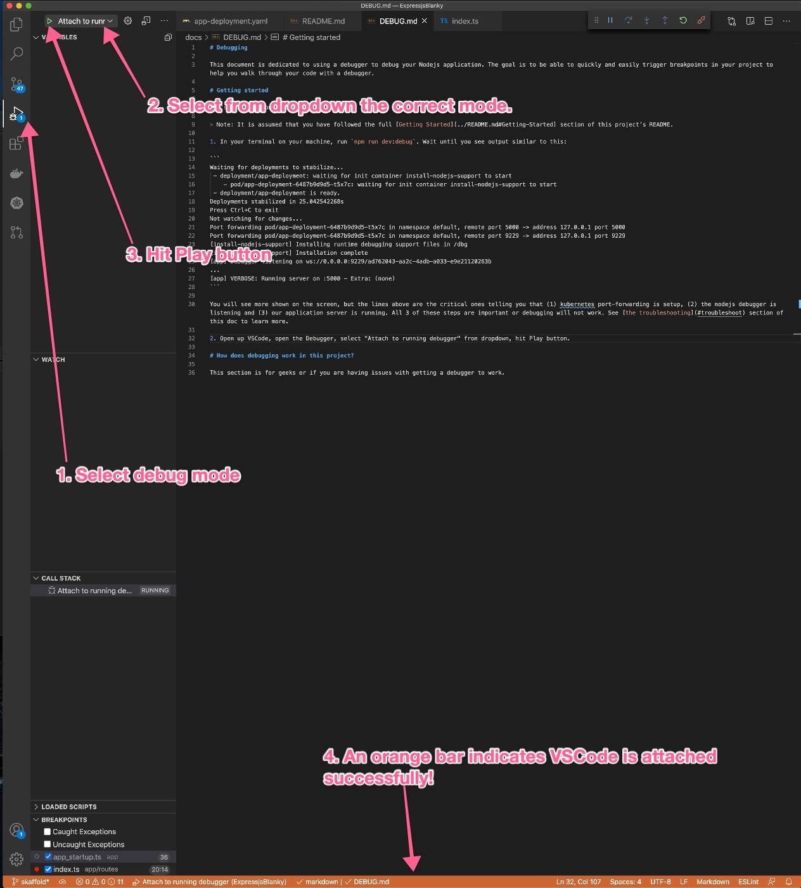
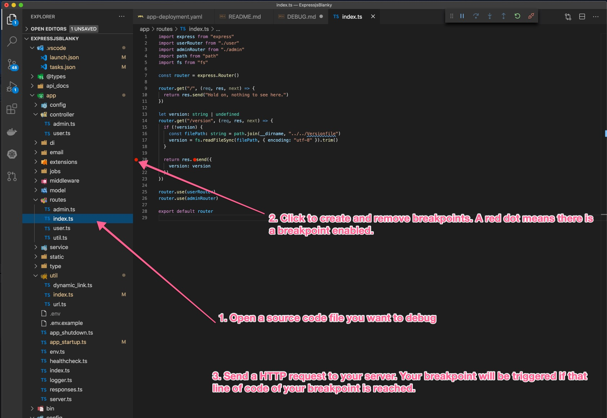
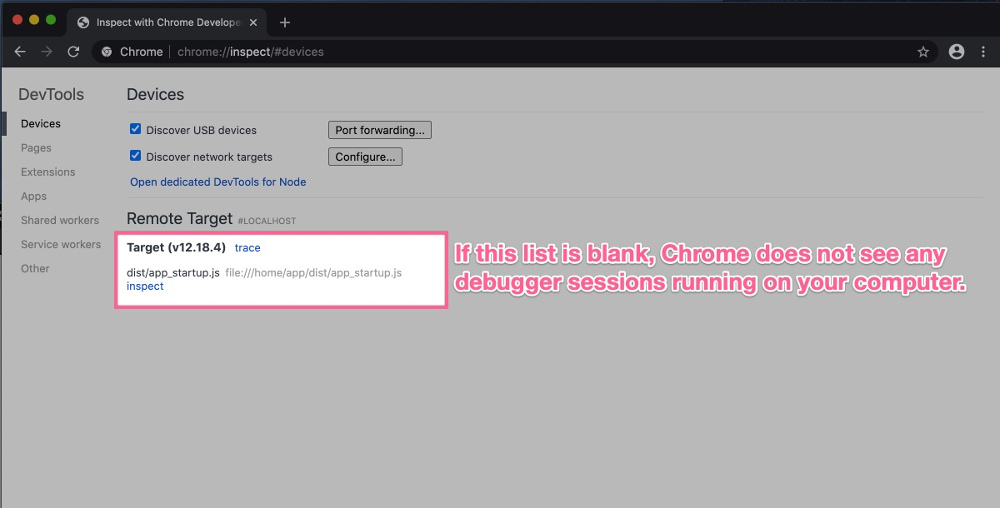

# Debugging

This document is dedicated to using a debugger to debug your Nodejs application. The goal is to be able to quickly and easily trigger breakpoints in your project to help you walk through your code with a debugger.

> Note: It is assumed that you have followed the full [Getting Started](../README.md#Getting-Started) section of this project's README and you're able to send HTTP requests to your nodejs application running on your local machine.

> Note: This doc assumes you are using VSCode to debug your tests. It's up to you to get debugging working with another tool.

# Getting started

Let's get you debugging your code!

> Note: This doc goes over how to use VSCode to debug your code. You can use [another client if you wish](https://nodejs.org/en/docs/guides/debugging-getting-started/#inspector-clients).

1. In your terminal on your machine, run `npm run dev:setup`, just like when developing your app. Then, run the command `npm run dev:debug`. Wait until you see output similar to this:

```
Waiting for deployments to stabilize...
 - deployment/app-deployment: waiting for init container install-nodejs-support to start
    - pod/app-deployment-6487b9d9d5-t5x7c: waiting for init container install-nodejs-support to start
 - deployment/app-deployment is ready.
Deployments stabilized in 25.042542268s
Press Ctrl+C to exit
Not watching for changes...
Port forwarding pod/app-deployment-6487b9d9d5-t5x7c in namespace default, remote port 5000 -> address 127.0.0.1 port 5000
Port forwarding pod/app-deployment-6487b9d9d5-t5x7c in namespace default, remote port 9229 -> address 127.0.0.1 port 9229
[install-nodejs-support] Installing runtime debugging support files in /dbg
[install-nodejs-support] Installation complete
[app] Debugger listening on ws://0.0.0.0:9229/ad762043-aa2c-4adb-a033-e9e21120263b
...
[app] VERBOSE: Running server on :5000 - Extra: (none)
```

> Note: This command might take a few minutes to complete and turn on the debugger.

You will see more shown on the screen, but the lines above are the critical ones telling you that (1) kubernetes port-forwarding is setup, (2) the nodejs debugger is listening and (3) our application server is running. All 3 of these steps are important or debugging will not work. See [the troubleshooting](#troubleshoot) section of this doc to learn more.

2. Open up VSCode, open the Debugger, select "Attach to running debugger" from dropdown, hit Play button.



3. Create breakpoints in your Typescript code.



> Note: The instructions above will only trigger breakpoints in your application code _after your application server has started_ (the expressjs server has started and is waiting to receive requests). If you need to debug code before the server starts up it will take some additional work. You need to manually add `--inspect-brk` to your `Dockerfile` CMD. Your CMD line will look something similar to `CMD ["node", "--inspect-brk", ...]`. Then run `npm run dev:debug` and start the VSCode debugger like normal. This will start the your application in debug mode like normal, but will automatically trigger a breakpoint before _any_ of your code starts allowing you to hit breakpoints anywhere in your code base.

# Debug tests

When you are writing unit or integration tests, it is handy to be able to debug tests using a debugger. This project is setup to do just that.

1. Open VSCode, create breakpoints in VSCode. You can create breakpoints in your test code or in your application code.


2. Open the Debugger, select "Jest Current File" or "Jest All" from the dropdown, hit Play button. "Jest Current File" will execute the current Jest file that you have focused in VSCode. "Jest All" will run _all_ tests with a debugger attached.


There are other ways to do this besides a debugger task. There are VSCode extensions that can help you run jest tests, too ([I like this one](https://marketplace.visualstudio.com/items?itemName=firsttris.vscode-jest-runner)). Use what works well for you.

> Note: The VSCode configuration came from [this official VSCode recipe](https://github.com/microsoft/vscode-recipes/tree/master/debugging-jest-tests).

# Troubleshoot

This section is for geeks. Read it if you're curious on how this is working or if you are having troubles getting the debugger to work.

This project is setup to run our application inside of Docker container running in Kubernetes. It runs Jest tests using nodejs installed on your machine with no containers involved. This makes the debugger configuration different for each of them.

### How debugging works for development

1. This project uses the tool Skaffold to run your application in a container in Kubernetes. To enable nodejs debugging, all you need to do is pass `--inspect` to `node` when you run your application. Skaffold comes with [a handy command](https://skaffold.dev/docs/references/cli/#skaffold-debug) `skaffold debug`. `skaffold debug` [will automatically add `--inspect` for you](https://skaffold.dev/docs/workflows/debug/) without you needing to change any of your codebase.

You know that the nodejs debugger is enabled when you run `npm run dev:debug` and you see this in the output:

```
[install-nodejs-support] Installing runtime debugging support files in /dbg
[install-nodejs-support] Installation complete
[app] Debugger listening on ws://0.0.0.0:9229/ad762043-aa2c-4adb-a033-e9e21120263b
```

> Tip: If you do not see this output, I suggest that you check out the [skaffold docs on debugging](https://skaffold.dev/docs/workflows/debug/) to see if `--inspect` is indeed being added to the `node` command.

At this time, you should also be able to connect to your application. Just like in development on your machine, you can send HTTP requests to your server.

2.  Skaffold will automatically start the nodejs debugger for you, but that does not mean that you are able to connect to the debugger yet. Applications that run inside of a Kubernetes cluster are not accessible to the host machine by default. This means that when your nodejs debugger is running _inside of a Kubernetes pod_, your host machine is not able to connect to it.

Use [Kubernetes port forwarding](https://kubernetes.io/docs/tasks/access-application-cluster/port-forward-access-application-cluster/) to get this working. Port forwarding maps a port on your host machine to a port inside of your Kubernetes pod. This means that when you communicate with the mapped port on your host machine, you are actually communicating with the application in the Kubernetes pod!

Skaffold [makes port forwarding super easy](https://skaffold.dev/docs/pipeline-stages/port-forwarding/). You can use Kubernetes port forwarding on it's own without Skaffold but Skaffold automates this process for you when you run Skaffold making it much easier.

You know this step is working when you run `npm run dev:debug` and you see this in the output:

```
...
Port forwarding pod/app-deployment-6487b9d9d5-t5x7c in namespace default, remote port 5000 -> address 127.0.0.1 port 5000
Port forwarding pod/app-deployment-6487b9d9d5-t5x7c in namespace default, remote port 9229 -> address 127.0.0.1 port 9229
...
```

Specifically, you want to see `remote port 9229 -> address 127.0.0.1 port 9229` which indicates that port 9229 is being used on _both_ the host machine and Kubernetes pod. If you do not see this line, see the [Skaffold](https://skaffold.dev/docs/pipeline-stages/port-forwarding/) and [Kubernetes](https://kubernetes.io/docs/tasks/access-application-cluster/port-forward-access-application-cluster/) documentation on port forwarding.

Besides seeing port forwarding in your console output, you can use Google Chrome as a tool to see if your computer is able to find the nodejs debugger running in a Kubernetes pod and connect to it.

- Open up Google Chrome.
- Enter `chrome://inspect` in the address bar and press Enter.
- You see at least 1 target listed on the screen. Like this:
  

> Tip: Click "Configure" in `chrome://inspect` tab and make sure that `localhost:9229` is in the list.

3. The nodejs debugger is already running at this point. It's ready for a debugger client tool (like VSCode) to attach to it. This is very easy for VSCode to do! This project already contains a configuration in `.vscode/launch.json` to attach to the nodejs debugger. [Here](https://code.visualstudio.com/docs/nodejs/nodejs-debugging#_attaching-to-nodejs) are the official docs for more details on how to attach to a nodejs debug session.

### How debugging works for running tests

Tests are executed on a computer that has nodejs installed on it. This is unique to how we run applications in this project using Docker containers and Kubernetes. We can run tests inside of Docker containers but jest runs really slowly in Docker containers. Also, it's not a huge deal if tests run in a different way that we run our application.

The magic here is in the power of VSCode and it's `.vscode/launch.json` file. There is a very lengthy [article on nodejs debugging](https://code.visualstudio.com/docs/nodejs/nodejs-debugging) which explains the syntax of using the VSCode `launch.json` file. This article is hard to understand and overwhelming. I like to avoid it if I can help it. Luckily, VSCode provides an [official Jest debugging recipe](https://github.com/microsoft/vscode-recipes/tree/master/debugging-jest-tests) for VSCode that we can copy and use.

The way I understand it is (note: I could be very, very off here): when you run a command in VSCode, it automatically starts the debugger and tries to attach it to a debug session from nodejs. Jest automatically starts the nodejs debugger when it starts up. The hard work is done for you! All you need to do is run jest and pass in arguments to only run a test file or a test function. That's where the recipes come in handy! They show you how to do that.

This is what VSCode extensions for jest does, too. They are able to execute jest with given arguments and runs the VSCode debugger or not.
