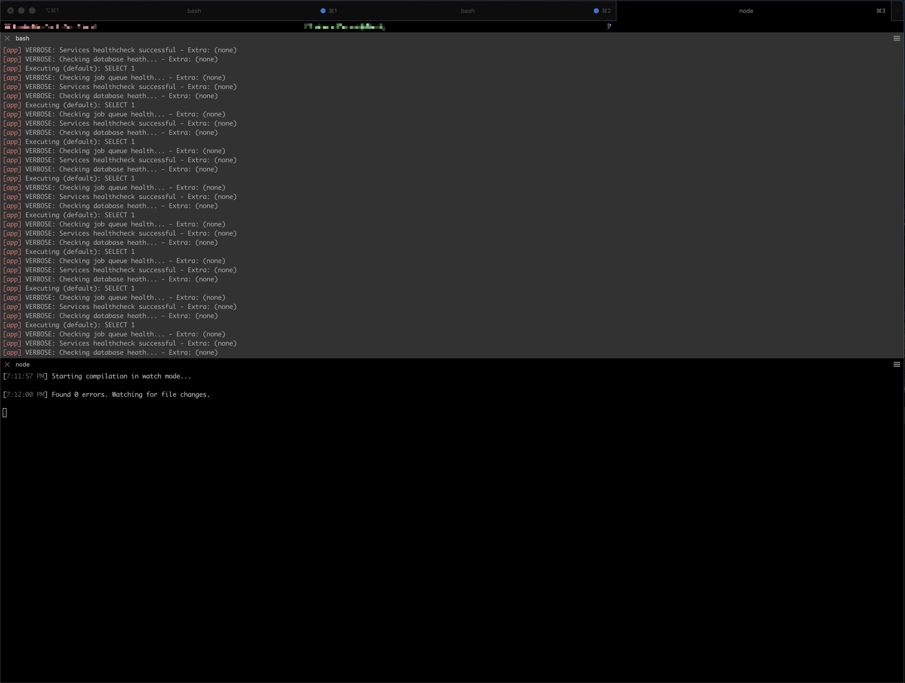
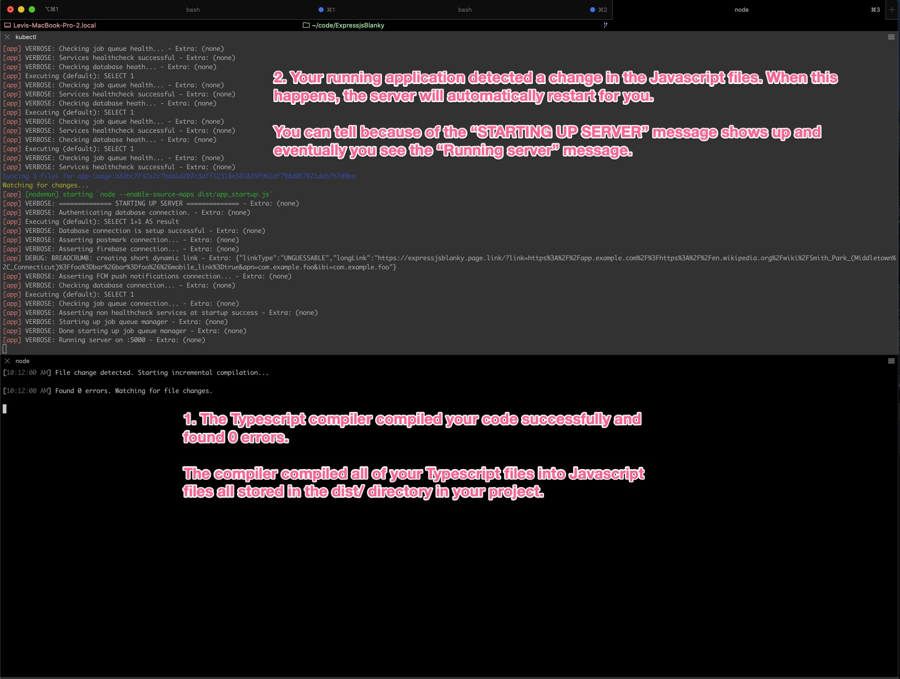
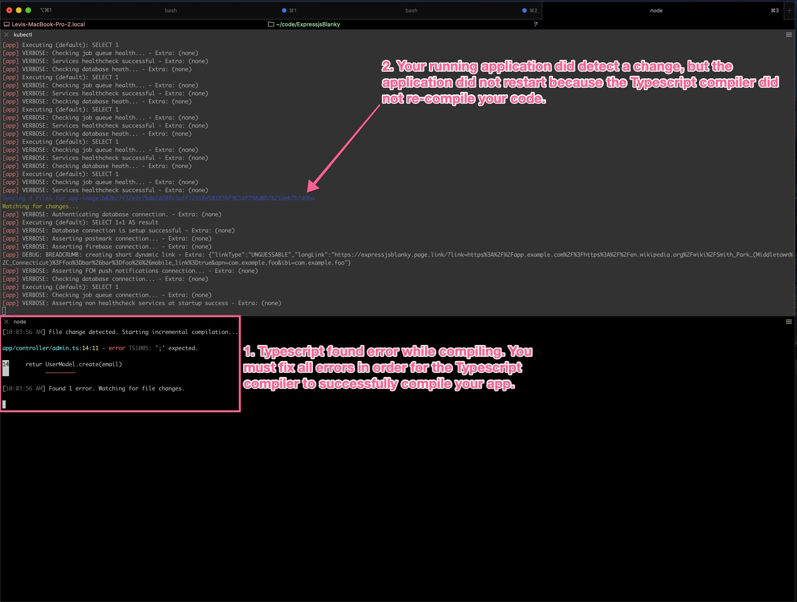
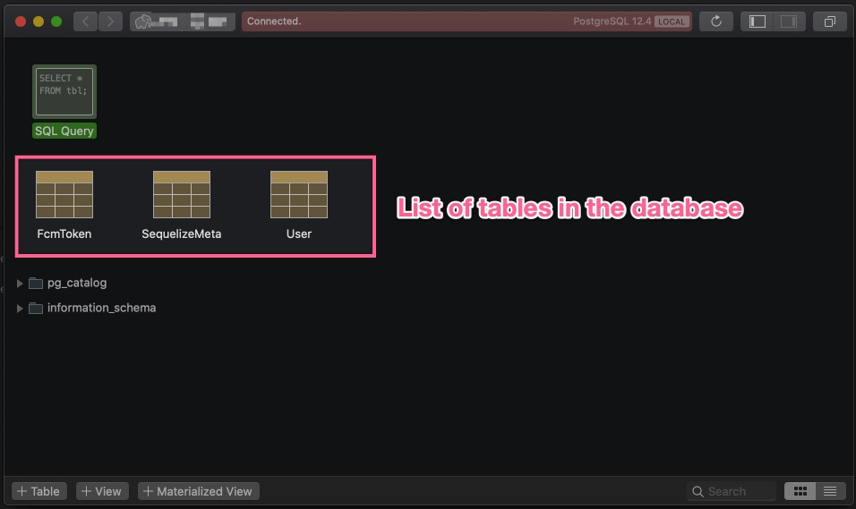
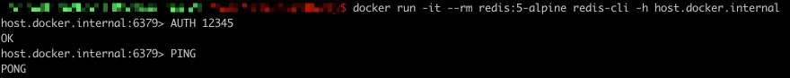

# Development

Are you looking to do some development to this project? Fix a bug or add a feature? Follow this document to learn to get started developing. This document also covers how this project is configured for development for easier troubleshooting in case you run into issues.

Wondering how to use a debugger to debug your code? Check out the [debug](#DEBUG.md) document.

# Goals of development

In order to have a successful development stack, these goals should all be satisfied:

1. Development environment and production environment should match as close together as possible. This means the same stack, same tooling, same versions of software, etc.
2. Hot reloading. When you make a change to your source code, your application running on your machine should reload for you so you can test out the change, fast.
3. Be able to debug your application with a debugger.
4. Be fast and easy to use. If your [inner development loop](https://web.archive.org/web/20200503174919/https://mitchdenny.com/the-inner-loop/) is slow, you will be less productive in your development.

# Getting started

- To get your application running, you need to have some configuration files on your machine. If you are reading this document you should have these files ready for you already. To get these configuration files, you need to run the command `cici decrypt`. This will get the secrets on your computer ready for you to use. 

- Install nodejs on your machine. This project recommends that you use a tool called `nvm` to install nodejs. Run the install script [here](https://github.com/nvm-sh/nvm#installing-and-updating) to install nvm and then run the command `nvm use` from the root directory of this project. `nvm use` will read the `.nvmrc` file and install that version of node. That way you are using a version of nodejs that this project supports.

After node is installed, run the command `npm install`.

- Time to get your application running. This application requires the following steps:

1. Start a Postgres database used to store data. Postgres is a typical SQL style database. We use this to store the majority of the data for our application.
2. Start a Redis database used to store key value based data. Redis is a special kind of database in that it stored data in key/value pairs. Redis is mostly used to store temporary data, caches, or small amounts of data. This is because the database is _extremely_ fast because the whole database exists on memory! We use Redis to store data that applies to all users (if you were a weather application, store weather for all cities in Redis) or temporary data (such as the email of a user you need to send an email to. Once you send the email 1 second later in the background, delete the email).
3. Run the application server. The application runs inside of a Docker container that's then deployed in a local Kubernetes cluster using minikube.

This configuration above is close to how our production environment is setup where we have databases deployed on a server and the production application running in Docker containers in a Kubernetes cluster.

Run the command `npm run dev:setup`. This script will perform all of the steps for you to get your databases and app running.

This script outputs lots of information. You may have to wait a few seconds to a handful of minutes until everything is done.

> Note: The `dev:setup` command does not stop. It continues to run until you press Ctrl+C to stop it.

> Tip: If you run the `dev:setup` command and see something wrong, stop it with Ctrl+C then run the command again. When asked if you want to clear the databases respond with Yes. This performs a reset which should help fix issues if you had any.

When you run the setup command, you should see output similar to this:

```
Starting up Postgres database...
Creating Postgres schema through database migration...
Postgres up successfully

Starting up Redis database...
Redis up successfully

...
Starting up development server...
Waiting for deployments to stabilize...
 - deployment/app-deployment: waiting for rollout to finish: 0 of 1 updated replicas are available...
 - deployment/app-deployment is ready.
Port forwarding service/app-service in namespace default, remote port 80 -> address 127.0.0.1 port 5000
[app] [nodemon] starting `node --enable-source-maps dist/app_startup.js`
[app] VERBOSE: Authenticating database connection. - Extra: (none)
[app] VERBOSE: Database connection is setup successful - Extra: (none)
[app] VERBOSE: Checking job queue connection... - Extra: (none)
[app] VERBOSE: Starting up job queue manager - Extra: (none)
[app] VERBOSE: Done starting up job queue manager - Extra: (none)
[app] VERBOSE: Running server on :5000 - Extra: (none)
```

You will see more output then this, but these are the important lines that indicate that your application was successfully started. This output is a good sign that your databases are running, your application server is connected to them, and your appliation server is running.

If you do not see the output above, follow [these steps](#Troubleshoot) to troubleshoot.

After your dev setup script is running, you don't need to touch it anymore. Keep the script running. You will now need to _open up a new terminal tab or window to run another command_. In this new terminal, run the command `npm run dev`. This starts the Typescript compiler in watch mode. This means that when you save any of your Typescript files (files ending with `.ts`) in the `app/` directory, the compiler will compile that code automatically for you.

> Note: The `npm run dev` script does not stop. It continues to run until you press Ctrl+C to stop it.

> Tip: I like to use [iTerm](https://iterm2.com/downloads.html) for macOS and split my screen to show 2 terminals in 1 window. This can be easier to manage then 2 separate windows.



- Open your code in a text editor, write code, when you are ready to try out your app save all of your files. You will see your 2 terminal windows react to you saving your files. You should see this result when you save your files:



...but if your code has compilation errors in it, you will see a different output:



If you get to this point, your development environment is working great. Have fun!

# View database content

When developing your app, it can be very handy to view the contents of your databases. Follow these instructions to learn how to connect to them and view the contents of them.

### Postgres database

Using a Postgres client application (my personal favorite is [Postico](https://eggerapps.at/postico/)) and try to connect to the Postgres database. The connection information you enter into the client will look similar to this:


For host you will use `localhost`. All other information such as database name, password, view your `.env` file in your project for those values.

If your postgres client connects to the database successfully, you are connected!

Once connected, you can click on any of the tables to view the contents of it. Or, you can run raw queries against it.



### Redis database

Viewing the contents of a Redis database is all done through the command line. This might seem like a pain, but it's not as bad as you think.

Run this command to connect to the development Redis database:

```
docker run -it --rm redis:5-alpine redis-cli -h host.docker.internal
```

> Note: `host.docker.internal` is a special URL that docker containers have added to their DNS. This address points to the host machine that the Docker container is running on. Because we are running the Redis CLI inside of a Docker container, we need to use this address instead of `localhost` since `localhost` points to the Redis CLI Docker container itself.

When you run the command, you need to authenticate with the server with a password and then run the command "PING" to expect the output "PONG". The password is found in `./docker/redis.conf` after `requirepass`.



Once you receive a `PONG` response back, you are successfully connected and authenticated. You are now able to run any of the [Redis commands](https://redis.io/commands) on the Redis database. You will more then likely be using these basic Redis commands to read and write data:

- [GET](https://redis.io/commands/get) to get value of a key.
- [SET](https://redis.io/commands/set) to set value for a key.
- [Get all keys matching a pattern](https://redis.io/commands/keys)
- [DEL](https://redis.io/commands/del) to delete a key.

# Testing

Let's talk about automated software testing. Unit and integration tests in particular. This project is all setup for you to write and execute them. It's highly encouraged to do so! Testing makes you more confident in your code along with many other benefits that are worth the time investment.

> Note: This document will not teach software testing, unfortunately. This document would simply become too long _and_ part of software testing is lots and lots of practice! Use the resources in this section to help guide you on how to run tests and then you can take that to learn more about how to write them. After that, practice. Trust me.

To run tests, it's quite simple. Run `npm run test:setup` and then `npm run test`.

> Note: Tests run via [Jest](https://jestjs.io/) running in node. We run our application inside of Docker containers in a Kubernetes cluster but we run tests on their own just on node without containers. The biggest reason for this is because at this time Jest runs slowly in Docker containers.

### Writing tests

Tests in this project are written and executed using the [Jest](https://jestjs.io/) tool. If you are familiar with Jest, the documentation website is quite good. I recommend you learn about:

- [Matchers](https://jestjs.io/docs/en/using-matchers)
- [Testing `async` code](https://jestjs.io/docs/en/asynchronous)
- [Setup and teardown](https://jestjs.io/docs/en/setup-teardown)
- [Mocks](https://jestjs.io/docs/en/mock-functions)
- [expect API](https://jestjs.io/docs/en/expect) resource (good to bookmark)
- [mock API](https://jestjs.io/docs/en/mock-function-api) resource (good to bookmark)

Below are some notes about how tests are written and setup in this project. That should help you figure out how to write tests for this project.

- All tests are written inside of `./tests`. Unit tests are stored in `./tests/unit/` and integration tests in `./tests/integration/`. The tests are located in separate directories because (1) organization purposes and (2) allows you to execute each type of types individually if you choose to (run `npm run test:integration` to run only integration tests and `npm run test:unit` to only run unit tests).

- This project uses [mocking](https://stackoverflow.com/questions/2665812/what-is-mocking) and [dependency injection](https://web.archive.org/web/20201012233638/https://www.jamesshore.com/v2/blog/2006/dependency-injection-demystified) to make unit testing more predictable and flexible. Mocks are created manually and stored inside of `./tests/mocks/`.

  To learn how to create mocks, see `./tests/mocks/email_sender.ts` for an example. This mock and all mocks follow these steps:

1. Create an `interface` that defines all of the functions that your class will have. `EmailSender` is an example of an interface.
2. Create a class that implements this interface. Write all of the code for each function of your class. This class is the class your app will use. See `AppEmailSender` class for an example.
3. Time to create the mock. Create a class that implements this interface for mocking purposes. See `EmailSenderMock` for an example. These classes follow the same pattern. You create 1 mock property (`sendLoginMock` is an example) for each function of the interface. Return the mock property for each function of the interface.
4. Use this new mock in your tests. See `./tests/integration/controller/0.1.0/admin.spec.ts` for an example. We are creating a mock instance and using the dependency injection graph to provide this mock to our application. For unit tests, you can simply provide a mock via the class constructor.

- Jest runs `./tests/setup.ts` before running our tests. This is a great place to setup our [setup and teardown functions](https://jestjs.io/docs/en/setup-teardown) for Jest.

# Troubleshoot

## Application troubleshooting

When you run the `dev:setup` command, the following series of events should happen. Follow through this list of events and follow the troubleshooting steps to help you. 

1. When you run the setup command, you should see output like this that ends with `Waiting for deployment to stabalize...`:

```
Listing files to watch...
 - app-image
Generating tags...
 - app-image -> app-image:f5e6a4e-dirty
Checking cache...
 - app-image: Found Locally
Tags used in deployment:
 - app-image -> app-image:75e02dde060810c0f586fe33c81696a8c2b13147e80c7d2b14d2965643ef6b07
Starting deploy...
 - deployment.apps/app-deployment created
 - service/app-service created
 - poddisruptionbudget.policy/app-pdb created
 - configmap/app-configmap created
 - ingress.extensions/app-ingress created
WARN[0001] image [app-image] is not used by the deployment
 - secret/app-config created
 - secret/dotenv created
Waiting for deployments to stabilize...
```

If you do not see this output, the setup command failed at some point. You need to view the log file of the setup command. When the setup command starts, it tells you where the full logs are stored: `Full script output located at /tmp/dev_setup.log. In case of an error, check out that file.` Open up this file and check for errors. 

2. You will see the message `Waiting for deployments to stabilize...` for around 30 seconds. After that time, you should see your server startup successfully:

```
Deployments stabilized in 19.456625997s
Port forwarding service/app-service in namespace default, remote port 80 -> address 127.0.0.1 port 5000
Press Ctrl+C to exit
Watching for changes...
[app] [nodemon] 2.0.5
[app] [nodemon] to restart at any time, enter `rs`
[app] [nodemon] watching path(s): *.*
[app] [nodemon] watching extensions: js,mjs,json
[app] [nodemon] starting `node --enable-source-maps dist/app_startup.js`
[app] VERBOSE: Starting up job queue manager - Extra: (none)
[app] VERBOSE: Done starting up job queue manager - Extra: (none)
[app] VERBOSE: ============== STARTING UP SERVER ============== - Extra: (none)
[app] VERBOSE: X------ PROJECTS - Extra: (none)
[app] VERBOSE: X------ PROJECTS SUCCESS - Extra: (none)
[app] VERBOSE:         Projects loaded: expressjsblanky - Extra: (none)
[app] VERBOSE: -X----- INITIALIZE DATABASE - Extra: (none)
[app] VERBOSE: Authenticating database connection. - Extra: (none)
[app] Executing (default): SELECT 1+1 AS result
[app] VERBOSE: Database connection is setup successful - Extra: (none)
[app] VERBOSE: -X----- INITIALIZE DATABASE SUCCESS - Extra: (none)
[app] VERBOSE: --X--- POSTMARK CONNECTION - Extra: (none)
[app] VERBOSE: --X--- POSTMARK CONNECTION SUCCESS - Extra: (none)
[app] VERBOSE: ---X--- FIREBASE CONNECTION - Extra: (none)
[app] DEBUG: BREADCRUMB: creating short dynamic link - Extra: {"linkType":"UNGUESSABLE","longLink":"https://expressjsblanky.page.link/?link=https%3A%2F%2Fapp.example.com%2F%3Fhttps%3A%2F%2Fen.wikipedia.org%2Fwiki%2FSmith_Park_(Middletown%2C_Connecticut)%3Ffoo%3Dbar%26bar%3Dfoo%26mobile_link%3Dtrue&apn=com.example.foo&ibi=com.example.foo"}
[app] VERBOSE: ---X--- FIREBASE CONNECTION SUCCESS - Extra: (none)
[app] VERBOSE: ----X-- PUSH NOTIFICATIONS - Extra: (none)
[app] VERBOSE: ----X-- PUSH NOTIFICATIONS SUCCESS - Extra: (none)
[app] VERBOSE: -----X- DATABASE CONNECTION - Extra: (none)
[app] Executing (default): SELECT 1
[app] VERBOSE: -----X- DATABASE CONNECTION SUCCESS - Extra: (none)
[app] VERBOSE: ------X REDIS CONNECTION - Extra: (none)
[app] VERBOSE: ------X REDIS CONNECTION SUCCESS - Extra: (none)
[app] VERBOSE: ============== RUNNING SERVER :5000 ============== - Extra: (none)
```

If you wait more then 30 seconds and are still stuck on `Waiting for deployments to stabilize...` then you need to view the logs of your application container. Run the command `kubectl get pods`. You will see output like this:
```
NAMESPACE              NAME                                        READY   STATUS   
default                app-deployment-X8366-3e99                   0/1     Running  
```

Now, run `kubectl logs app-deployment-X8366-3e99` to view the logs of the pod running. View these logs to look for errors with the application starting. 

> Note: See [this GitHub issue](https://github.com/GoogleContainerTools/skaffold/issues/4911) to learn more about why you must run `kubectl logs` manually instead of viewing the logs in the output of the setup command. 

> Tip: Running skaffold with `verbosity=debug` option helps when debugging why Skaffold is not working well. 

## Postgres database troubleshooting

- A good first step is to check the logs of the `dev:setup` command. When the script starts, it tells you where the full logs are stored:

```
Full script output located at /tmp/dev_setup.log. In case of an error, check out that file.
```

Open up this file. Check the output after `Starting up Postgres database...` and before `Postgres up successfully`. If you see any errors, that would be the reason your database is not working. Fix the issues and try again.

- Run the command `docker ps`. Some of those columns are not super important. You should see the postgres database listed and look like this:

```
IMAGE                PORTS                    NAMES
postgres:12-alpine   0.0.0.0:5432->5432/tcp   dev-postgres
```

That means the database is running.

- See if you can connect to your Postgres database. Follow the instructions in the section on [how to view contents of database](#View-database-content) for Postgres to see if you can connect to the database.

If you see the database is running and you can connect to it, there is a good chance the Postgres database is running and ready for your application to connect to it. There is probably an issue with the application not being able to connect.

## Redis database troubleshooting

- A good first step is to check the logs of the setup command. When the script starts, it tells you where the full logs are stored:

```
Full script output located at /tmp/dev_setup.log. In case of an error, check out that file.
```

Open up this file. Check the output after `Starting up Redis database...` and before `Redis up successfully`. If you see any errors, that would be the reason your database is not working. Fix the issue and try again.

- Run the command `docker ps`. Some of those columns are not super important. You should see the redis database listed and look like this:

```
IMAGE                PORTS                    NAMES
dev-redis:latest     0.0.0.0:6379->6379/tcp   dev-redis
```

That means the database is running.

- See if you can connect to your Redis database. Follow the instructions in the section on [how to view contents of database](#View-database-content) for Redis to see if you can connect to the database.

If you see the database is running and you can connect to it, there is a good chance the Redis database is running and ready for your application to connect to it. There is probably an issue with the application not being able to connect.

# How this works

To give you a better idea of how the development flow is setup, check out this *optional* section to learn more. This section is meant for nerds who want the details to open up the black box. 

We need our [development setup to be as close to our production setup as possible](https://12factor.net/dev-prod-parity). A very high level overview of our production environment is:
1. A remote Postgres database running on a Linux server. 
2. A remote Redis database running on a Linux server. 
3. Our application code runs in a Docker container deployed in a Kubernetes cluster. 

The databases are pretty easy to deploy for development. We run the databases in a Docker container locally on your machine that our application connects to via the network. We use Docker because (1) you don't need to install postgres or redis on your computer and (2) you can destroy and re-create your databases quick and easy. In production we do not use Docker. The OS that you are running your database server on doesn't matter that much that I can tell as long as the database configuration, version, and connection method is the same.

To deploy our application, we use a really handy tool [skaffold](https://skaffold.dev/). Skaffold is a really neat tool that will build a Docker image for your application and deploy the built image to a [minikube](https://minikube.sigs.k8s.io/) cluster. We use the same Kubernetes configuration manifests between development and production keeping the two environments closely the same. 

We try our best to keep our entire code base and configuration of our application identical between production and development. Unfortunately, there are some times when we cannot follow this rule:
* We have 2 separate Docker `Dockerfile`s. 1 for production, 1 for development. That is because [skaffold does not support Docker builder images](https://github.com/GoogleContainerTools/skaffold/issues/1766#issuecomment-591838285). We use builder images in our production `Dockerfile` to keep our image slim and more secure but when using skaffold in development, we cannot do this. 

* The production image wants to be as small in size and footprint as possible. The development image needs some extra development dependencies for hot-reloading, a shell in the container for debugging, and maybe some extra features. This unfortunately means we need 2 separate images. We try to keep all of the core logic the same between these 2 `Dockerfile`s as much as we can. 

### How hot-reload works

The `skaffold dev` command comes equipped with [hot-reloading](https://skaffold.dev/docs/pipeline-stages/filesync/). This means that when you edit your source code, your nodejs application will restart automatically for you. Skaffold has 2 hot-reload features available to you. (1) A feature they call file sync which will inject changed code into your already running Docker container. This makes development very fast. (2) Any file not is not setup with Skaffold file sync will cause a full Docker image rebuild and deploy when the file changes. You want your source code to use file sync and allow other files to cause the full rebuild. 

Skaffold comes with [examples](https://github.com/GoogleContainerTools/skaffold/tree/master/examples/hot-reload) on how to setup hot-reloading for a nodejs application. However, we are using the Typescript lang and not Javascript. This makes our hot-reloading setup a little more complex. To get this to work, we setup the project to work like this:
* In the skaffold config file, we setup file sync to sync all javascript, typescript, and .map files. You might be wondering, "Why not just setup sync with the typescript files, only?" The answer is that if Skaffold detects that you saved files in your project that are *not* setup with file sync, Skaffold will automatically rebuild and deploy a new Docker image for you. This is what we want to avoid doing. 

When you save a Typescript file, that does not mean that just a `.ts` file got updated. It also means that a new `.js` file and a new `.map` file also got saved. This is because the Typescript compiler transpiles the code into Javascript code (with a source map file, `.map`). The workaround to getting file sync to work with typescript [1](https://github.com/GoogleContainerTools/skaffold/issues/1766#issuecomment-471128839)[2](https://github.com/GoogleContainerTools/skaffold/issues/1766#issuecomment-484273645) is to setup Skaffold file sync with all `.ts`, `.js`, and `.map` files. Even though our application Docker container does not ever read the Typescript files, we need file sync setup to avoid the full Docker rebuild. 

* We want our development Docker image to be as close to the production one as possible. This means that in development and in production we want to use nodejs to run our application instead of using something like Babel or [ts-node](https://www.npmjs.com/package/ts-node) that can run our `.ts` code directly in node without having to first compile it. 

This means that to get hot-reload working, we need to do 2 things: (1) compile our Typescript code into Javascript code for our nodejs app to run and (2) automatically restart nodejs when any of our compiled Javascript files change. 

While `skaffold dev` is running, we also have the Typescript compiler running in watch mode in another terminal window. We run the Typescript compiler on your computer, not in a Docker container. It will simply watch for when you save Typescript source code on your machine and then compile your project into the `dist/` directory on your computer. 

We setup the `dist/` directory with Skaffold file sync. When any changes happen in that directory, Skaffold will inject those changes into our already running Docker container. Cool, we have new Javascript files in that Docker container. Lastly, we use [nodemon](https://www.npmjs.com/package/nodemon) in the development Docker container that detects when any Javascript files got changed in the Docker container and it will restart nodejs for you. 

### Connecting to application in Docker container

Applications running inside of Docker containers in a Kubernetes cluster are not able to be reached by default. This is a feature of Kubernetes, not Skaffold. We need to send HTTP requests to our application in order to use it, right?! You can use [Kubernetes port forwarding](https://kubernetes.io/docs/tasks/access-application-cluster/port-forward-access-application-cluster/) to do that. Skaffold comes with a cool feature [that does port forwarding for you](https://skaffold.dev/docs/pipeline-stages/port-forwarding/). All we need to do is add to the skaffold config file and it will setup Kubernetes port forwarding for us when the application starts. This makes it possible to send requests to `localhost:5000` on our local machine and it sends those requests to the Docker container running in kubernetes. 

> Note: If port forwarding does not work for some reason, we should also be able to use a Kubernetes ingress if you enable ingress on minikube. 

