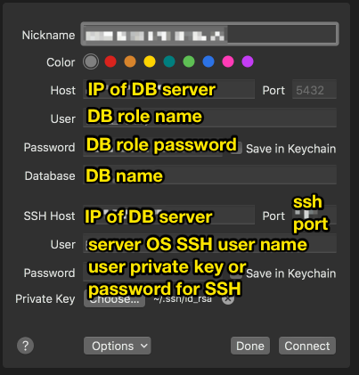

# Server

This document is a step-by-step guide on how to get your databases created and running on a Linux server.

> Note: This guide will assume that you are using one of the recommended services, [Linode](https://www.linode.com/) or [DigitalOcean](https://www.digitalocean.com/), to create your servers. You can also use something like [AWS](https://aws.amazon.com/) if that is what you are already comfortable with.

# Create server

Create a new Linux Debian server. For convenience, here is how to do that in [Linode](https://www.linode.com/docs/getting-started/) and [DigitalOcean](https://www.digitalocean.com/docs/droplets/how-to/create/). It's recommended to use the latest Debian OS version (see the [LTS](https://wiki.debian.org/LTS) schedule to see support of the OS). Debian is an OS you can depend on and is built well for a server.

When you create the server, make sure you take into consideration the following:

1. Add the server to a virtual private network. Linode and DigitalOcean both offer private networks. Create a new private network for your application and add the server to it. This private network is how we will have our application web server communicate with the databases.
2. Attach a _volume_ to the server. Linode and DigitalOcean both offer this. This attaches an extra hard drive to your server that can be upgraded and downgraded in size with the click of a button. Perfect for storing the data of our database on.
3. After you create the server, setup monitoring thresholds for CPU usage, memory usage, network usage that way you get notified if your machines ever spike which is usually a sign of a problem.

Once you create the new server, login to the server with SSH and then follow the steps below.

# Update packages

Just because it's a good idea with a new server: `apt-get update && apt-get upgrade`

# Change SSH port

When your server has the SSH port on the default port of 22, you will notice in your connection logs that your server receives lots of failed SSH connections at port 22. There are bots online that try to connect to servers that are configured in a weak way and they use automated ways to connect to your servers. We will change our SSH port number to stop them from pinging us.

_Note: Info from [here](https://www.cyberciti.biz/faq/howto-change-ssh-port-on-linux-or-unix-server/)_

1. Find the ssh config file. `find / -name "sshd_config" 2>/dev/null` will print sshd_config file locations. It will probably be `/etc/ssh/sshd_config`
2. `vi /etc/ssh/sshd_config` Locate line that read as follows: `Port 22` or `#Port 22`. Set this to: `Port 432`
3. `sudo service ssh restart` to make config changes happen.
4. Make sure the change worked. `ss -tulpn | grep 432` should print out info about ssh listening.
5. Try to SSH into the server from port 432 now in another terminal tab to see if you can connect to the server.

If your server provider offers a network level firewall, you can now enable the firewall and block all ports except 432.

# Create new user with sudo permissions

You are currently logged in as the `root` user account on the Linux server. This is generally a bad idea and you should not be using the root account to perform actions on your server. Let's create a new account and give it `sudo` permissions so you can run root level commands when you need to.

Run the following commands as the `root` user:

1. `adduser trunk` - this creates a new user named trunk (not a root, but a trunk, get it?). You will be asked to type a password (see [the tips section](#tips) to learn how to quickly and easily generate a secure password) . Hit enter when it asks for name and that stuff to skip it.
2. `adduser trunk sudo` - adds trunk to sudo group so it can run sudo commands. This means that you will have the ability to run commands like you were the root user by prefixing your command with `sudo`. Using `sudo` is secure because you must enter the password for the user to run the command.
3. `mkdir /home/trunk/.ssh` - we are now going to add a ssh key to the machine so you can SSH login to the machine using your computer's SSH key instead of password to enhance the security of the server.
4. `vi /home/trunk/.ssh/authorized_keys` - inside, paste your computer's public key contents. Get your public SSH key of your computer with `cat ~/.ssh/id_rsa.pub`.
5. Now, set permissions on your server. Run these commands:

```
chown -R trunk:trunk /home/trunk/.ssh
chmod 700 /home/trunk/.ssh
chmod 600 /home/trunk/.ssh/authorized_keys
```

Now if you logout and log back in with SSH on this new trunk user, you should be able to login successfully.

After you login, try to run `sudo echo "test"`. It will ask you for your trunk user password. Enter it and the command should run successfully. This means that this account is setup! Stay logged into this `trunk` account for now on to follow the remainder of this guide.

# Secure SSH login even more

1. `sudo vi /etc/ssh/sshd_config` and inside, make sure the file has these lines.

```
PermitRootLogin no # does not allow logging in as root on the server. You must use a user account instead.
PasswordAuthentication no # Does not allow using a password to login. Must user a SSH key.
PermitEmptyPasswords no # Does not allow logging into the machine with a user and no password.
```

> Note: To not allow a password to login with SSH, I recommend you generate a new SSH pair, add it to the server, then add it to a password manager so that way you have a backup SSH key pair to login. If you have a server that can only be logged in with your computer and you lose your computer, that's not good!

2. Restart SSH service `sudo service sshd restart`

3. Logout and log back in to make sure everything still works.

# Unattended upgrades

Installing unattended upgrades will automatically install security patches and keep our server safe while minimizing the chances of our server configuration getting messed up and making our server no longer work.

Resources:

- https://wiki.debian.org/UnattendedUpgrades
- https://help.ubuntu.com/lts/serverguide/automatic-updates.html

1. Install the software: `sudo apt-get install unattended-upgrades apt-listchanges`
2. You should not need to edit this, but you want to check it to make sure the defaults are set correctly. The file`/etc/apt/apt.conf.d/50unattended-upgrades` should have the lines in the `Unattended-Upgrade::Origins-Pattern` section uncommented along with the lines showing `Debian` and `Debian-Security` in that section.
3. Check the file`/etc/apt/apt.conf.d/20auto-upgrades` and make sure it contains:

```
APT::Periodic::Update-Package-Lists "1";
APT::Periodic::Unattended-Upgrade "1";
APT::Periodic::AutocleanInterval "7";
```

This says to update package lists, run unattended upgrade, and autoclean APT cache every 7 days.

4. Test that we have setup the software, run `sudo unattended-upgrade -d` to make sure it runs successfully.

# Fail2ban

fail2ban is good to prevent malicious attempts at logging into a machine. This plus a good firewall will be good to protect the server.

By default, fail2ban only listens to ssh but can be configured for more. It reads log files and bans clients after the program detects too many failed attempts. Don't worry. You can SSH into the machine and edit the blacklist if you or your team member gets banned by accident.

1. `sudo apt-get install fail2ban`. This will install fail2ban. You can optionally install email for notifications, but we are not going to.
2. `cp /etc/fail2ban/jail.conf /etc/fail2ban/jail.local` - overriding the jail settings. This file is pretty easy to read. It will include things like:

- `ignoreip` which allows you to white list IP addresses, DNS hosts. You can also use the program `fail2ban-client` to dynamically add whitelist IPs easily.
- `bantime` The length of time in seconds for which an IP is banned
- `findtime` The length of time between login attempts before a ban is set. For example, if Fail2ban is set to ban an IP after five (5) failed log-in attempts, those 5 attempts must occur within the set 10-minute findtime limit.
- `maxretry` How many attempts can be made to access the server from a single IP before a ban is imposed.

> Note: fail2ban comes with a good set of configs. If you ever want to change some of the config options, do this: `cp /etc/fail2ban/fail2ban.conf /etc/fail2ban/fail2ban.local` which will create a `.local` copy which is a file that overrides rules from `.conf` so you can keep the `.conf` untouched. We are going to leave the defaults because the config is only for setting logging and other settings like that. We will edit the jail settings which is more of the config you're probably looking for.
> Then, the rest of the config file is a long list of jails. These are various services like wordpress, ssh, nginx, apache, many others pre-configured to work with fail2ban. Make sure that in the settings _above_ the jails section, you do _not_ have `enabled = true`! fail2ban should not enable all jails, you should need to only enable jails that you want, manually.

So, go down to the sshd section where we will enable this jail.

The config file will look like this when you are done:

```
[sshd]
enable = true # enable this jail
port = 432 # this is the port we are listening on
... leave the rest of the sshd settings.
```

4. `sudo fail2ban-client reload`. Then, `sudo fail2ban-client status` and you should see 1 jail enabled with ssh listed.
   For a list of everything that `fail2ban-client` does, [check out the wiki](https://www.fail2ban.org/wiki/index.php/Commands)

# Postgres

Resources

- [Setup/install postgres Linode docs](https://www.linode.com/docs/databases/postgresql/debian-6-squeeze/)

# Install

1. `sudo apt-get install postgresql`
2. `passwd postgres` - Enter this from the shell, not within postgres. This changes the password for the `postgres` OS user account (see [tips](#tips) for suggestions to create secure passwords). Postgres when installed is configured to run with the `postgres` OS user that it creates for you.

   This `postgres` user account can be thought of like the `root` OS user (In Postgres they call this account a _superuser_ account). It's a user account with full admin permissions which makes it an account you want to be careful about using. Follow the same idea as you do with `root` and create a separate account (called _roles_ in Postgres) that's not a superuser to run commands against Postgres.

Now, it's time to change the password within the postgres software. Run `sudo -u postgres psql` as 1 command that will run the `psql` command as the `postgres` user account on the OS. It's the long version of this:

```
su - postgres # to login to the postgres user account
psql # connect to postgres DB
```

You are now in a postgres shell. Run `\password` from within the shell to change the password. Generate another password (see [tips](#tips) on advice) separate from the password you just made for the `postgres` OS user account. This password you're using is for the Postgres role, not the OS user account.

# Move the location of data to block storage

_Note: The following from [this guide](https://www.digitalocean.com/community/tutorials/how-to-move-a-postgresql-data-directory-to-a-new-location-on-ubuntu-18-04)_

1. Find out the name of the _volume_ that you attached to your server when you made it. Run `ls /mnt/` and you should see something like `volume_nyc1_01` listed.
2. Let's get the current location of the postgres data. `sudo -u postgres psql` and then from the postgres shell, run `SHOW data_directory;`. You will see something like:

```
Output
       data_directory
------------------------------
/var/lib/postgresql/11/main
(1 row)
```

2. Time to move it. First, we need to stop the database service: `sudo systemctl stop postgresql`. Now, after running `sudo systemctl status postgresql` you should see the last line saying that it is stopped.
3. `sudo rsync -av /var/lib/postgresql /mnt/volume_nyc1_01` - we are using rsync to copy over the existing data from the old location to the new one. If you run the following command and rsync isn't installed, run `sudo apt-get install rsync`. `-av` is (1) to copy over existing permissions so it's an exact copy and (2) verbose output to watch it.

**Warning:** Make sure when running rsync that there is no trailing `/` character or rsync will copy over the _contents_ of the directory instead of the actual directory.

**Warning:** If you need to run a backup of the original data, run `sudo mv /var/lib/postgresql/11/main /var/lib/postgresql/11/main.backup` and then during the cleanup step, we can remove it.

4. Now, let's change the save location in the config file of postgres `sudo vi /etc/postgresql/11/main/postgresql.conf`
   Thange this line for `data_directory`:

```
data_directory = '/mnt/volume_nyc1_01/postgresql/11/main'
```

5. Done! Let's start up postgres: `sudo systemctl start postgresql`, see if it worked with: `sudo -u postgres psql` and then running `SHOW data_directory;` which should now show the new location.
6. Cleanup. `sudo apt-get remove rsync`. If you made a backup, `sudo rm -Rf /var/lib/postgresql/11/main.backup`

# Create a database

This is pretty easy.

```
su - postgres # the role who creates databases and tables via the CREATE command is the owner. We want the superuser to be the owner so let's login with that role.
createdb name_of_db
```

Then, you can connect to it: `psql name_of_db`

# Create new role

You should not be connecting to postgres as the `postgres` user. That's bad because it's a Postgres _superuser_. You want your application to connect with a smaller amount of privileges.

As the postgres OS user `su - postgres`, run this command: `createuser name_of_role --pwprompt` (See [tips](#tips) for password generation help). I like to make the role name be the same as the name of my database I am creating. I will then configure the permissions so that this new role only has access to 1 database for good security.

> Note: The `createuser` command is not scary. You can view `createuser --help` to understand all it does. The command above has a nice set of defaults done.

> Note: If you need to change the roles password in the future, after logging into psql with the postgres super user account, `\password role_name` will change it for you. [Resource](https://www.postgresql.org/docs/9.0/sql-alterrole.html)

Now that we have created a new role, we need to give this user some permissions to do things. `su - postgres psql` to login to postgres, then run the commands:

```
# To make sure that *future roles* created do not automatically get permission to connect to this DB.
# Since you cannot connect, you cannot run queries. This will make it so all future roles created must run GRANT commands for new roles to perform actions.
REVOKE CONNECT ON DATABASE name_of_db FROM PUBLIC;

# Grant connect on db so that the role can run queries against the DB.
GRANT CONNECT ON DATABASE name_of_db TO name_of_role;

# Granting the permissions to the role.
GRANT SELECT, INSERT, UPDATE, DELETE ON ALL TABLES IN SCHEMA public TO name_of_role;

# To run DB migrations such as ALTER TABLE, you must be an owner. GRANT does not give you permission to run these commands. We are making our role the owner so that it can perform DB migrations on the database. Otherwise, it would require a superuser account to run the migrations and we like to keep superuser out of the equation as much as possible.
ALTER DATABASE name_of_db OWNER TO name_of_role;
```

_Note: Above from [this answer](https://dba.stackexchange.com/a/33960/87516)_

# Setup local password auth

By default, postgres is configured to allowing anyone to login to postgres command prompt as long as they are logged into their local OS user account. Let's change this so that postgres forces a password for some more security.

`sudo vi /etc/postgresql/11/main/pg_hba.conf` and inside, you will find a line that says:

```
local all all peer
```

Change this to being

```
local all all md5
```

Leave everything else the same.

`sudo systemctl restart postgresql` to make the changes.

# Configure Postgres

_Note: help from [this doc](https://www.linode.com/docs/databases/postgresql/configure-postgresql/)_

Postgres reads from a config file located in `/etc/postgresql/11/main/postgresql.conf`. Inside, you will find many differnet sections. We will go over things that you should change.

- `listen_addresses = "*"` - makes it so postgres listens over the Internet for connections. By default, Postgres only listens for connections in `localhost`. We set to `*` because we are connecting to the Postgres server that is behind a network firewall to disable direct external connections over the public Internet and we will only allow clients to connect via a private network.

- `shared_buffers = 128MB` - Set to 1/4 of the RAM of the machine. When Postgres gets installed it usually sets this for you.

There may be more to set such as WAL but for now, there is no need to change. Defaults should be good.

- Next, time to setup auth to allow host connections. We need to edit the auth file, `/etc/postgresql/11/main/pg_hba.conf`. Add this entry:

```
# TYPE DATABASE     USER         ADDRESS METHOD
host   name_of_db   name_of_role all     password
```

Now that all configuration is done, run `sudo systemctl restart postgresql` to restart postgres server.

> Note: When you want to connect to the postgres server from your computer for debugging purposes, you can still do that via SSH tunnel. This allows you as the developer to view the DB when you need but you don't need to create a firewall rule for it. See [tips](#tips) to learn how to do this.

# Redis

Resources:

- [DigitalOcean guide](https://www.digitalocean.com/community/tutorials/how-to-install-and-secure-redis-on-debian-10)

1. Let's install. `sudo apt install redis-server`
2. Connect Redis server to systemd to have more control over starting and running it. `sudo vi /etc/redis/redis.conf` and make sure this line is set:

```
supervised systemd # default is 'no'
```

While we are in the config file, let's do some more configuration.

```
# bind # make sure all bind lines are commented out so that Redis server is exposed to the Internet beyond 'localhost'

# add a password so that each client must `AUTH` command to run queries.
requirepass 12345 # See tips section in doc to learn how to generate secure password

# Disable some commands on the server by renaming them to something unguessable.
# You can also disable the command entirely by renaming the command to an empty string.
# Because we want to potentially enable commands later, we make them unguessable
# List of commands: https://redis.io/commands
# This set of commands is a good set to disable. I used to disable more but it messed up some of the npm modules I use.
rename-command FLUSHDB 60ZJtiiFV9pEb80afYagPeEyBqdwPTsjGQLLk9Rx
rename-command FLUSHALL 1QzgateEDP7u5Dqf0xXX0HkpX3R0lrKFoSf1SoJg
rename-command DEBUG NrUvBAc51fr2EQchpmhrmZHrgq1P0BjDm85pdQR7
rename-command CONFIG TYKTRqfmiNDH2dhs6yQmFS2aOXS9m3JiS2A7d0FA
```

After this, let's restart the server and then run some testing: `sudo systemctl restart redis`

To test that everything is working, run the series of commands to test that the Redis server connects, authenticates, saves data, restarts and persists data.

```
# On the server machine, run:
$ redis-cli
> PING # This should error saying you must AUTH
> AUTH ...password here...
> PING
PONG

> set test "It's working!"
> get test
"It's working!"
> exit

$ sudo systemctl restart redis # restart server to make sure that data is persisted after restart
$ redis-cli
> AUTH ...password here...
> get test
"It's working!"
> del test

> keys *
(empty list or set) # this means we have deleted all keys and the redis db is blank.
```

# Security

See [the Security doc](./SECURITY.md) to learn more about the security of the application. This includes the security of this server and databases.

# Tips

### Generate a secure password

`openssl rand 60 | openssl base64 -A` is a good command to generate a long, random password.

### Connect to Postgres over SSH tunnel

Some applications such as Mac OS [Postico](https://eggerapps.at/postico/) have SSH connection functionality built-in:



If you need to connect via `psql` CLI on your local machine, (1) first, create a SSH tunnel with this command: `ssh -p 432 -L 3333:IP-of-DB-server:5432 OS-ssh-account-username-to-login-to@IP-of-DB-server` where 432 is SSH port and 3333 is a port number you decide which you will then use as the postgres port number. This command creates a ssh tunnel with 2 ends: 1 end on the server at port 5432 which is the postgres port and the other port is 3333 which is what you will use on our machine.

Then, you can login on your machine `psql -h localhost -p 3333 postgres`

[Docs on ssh login for postgres](https://www.postgresql.org/docs/8.2/ssh-tunnels.html)
